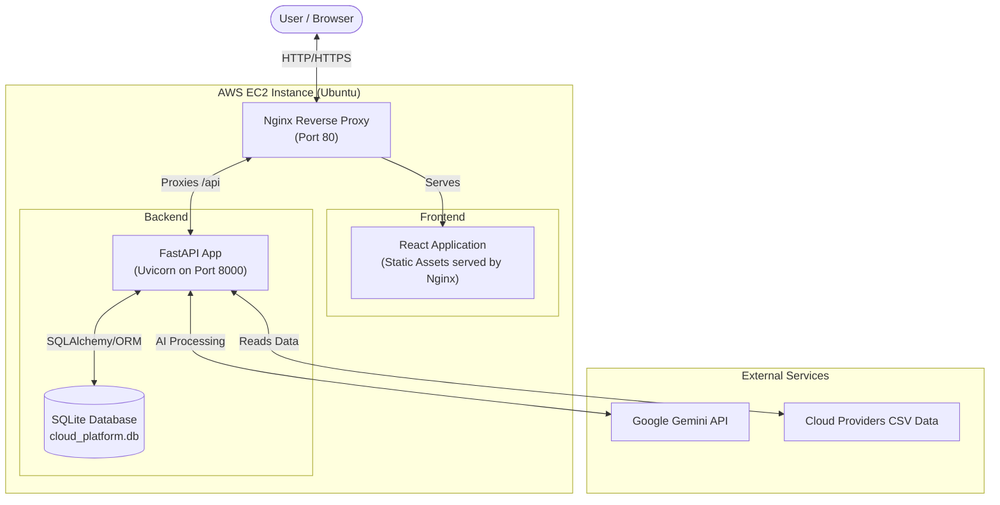
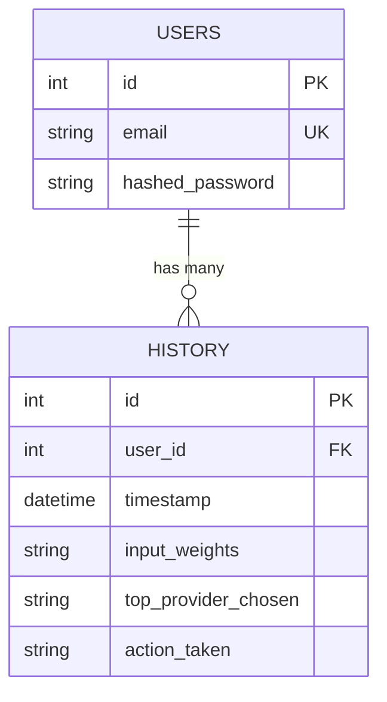
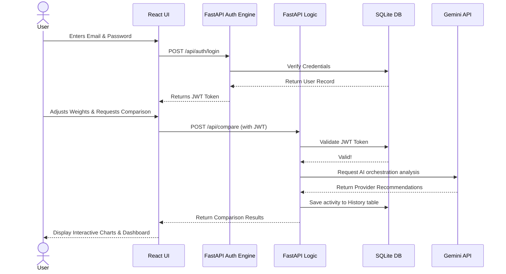
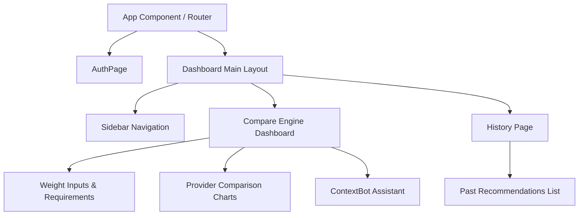
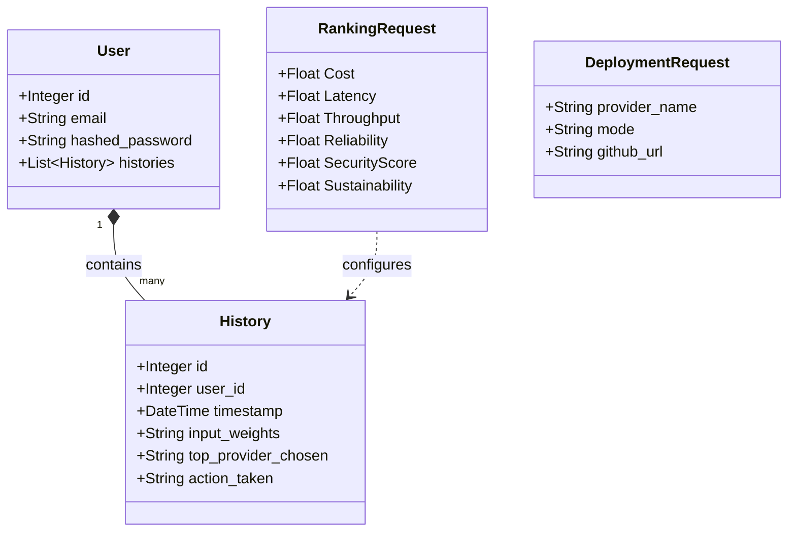
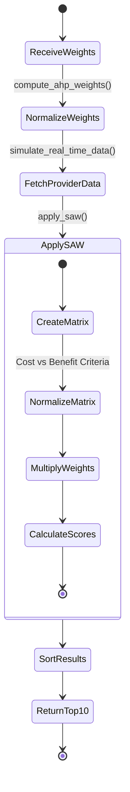
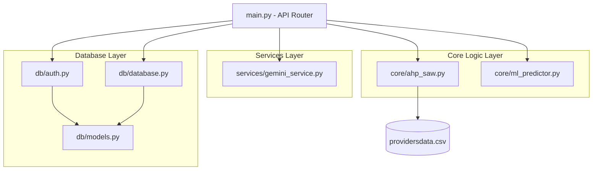
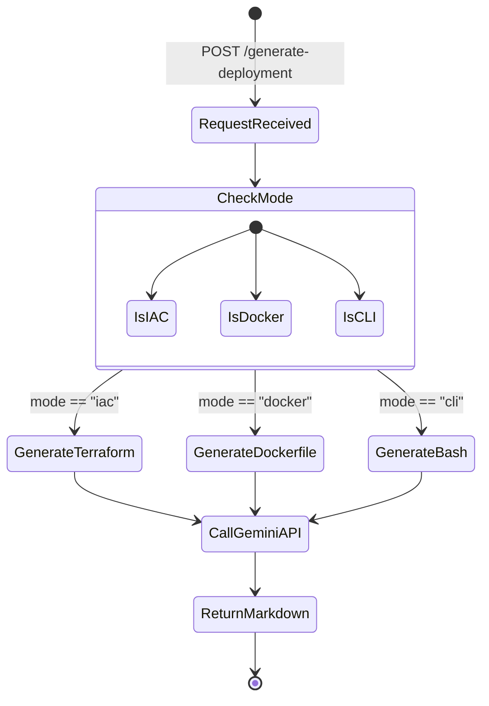

# CloudWise UML Diagrams

This document contains several architectural and UML diagrams that describe the structural and behavioral design of the CloudWise platform. These diagrams are written in [Mermaid.js](https://mermaid.js.org/) format, which can be rendered directly by GitHub natively, or viewed in IDEs via Markdown preview extensions.

## 1. System Architecture Diagram

This diagram displays the high-level architecture of your full-stack application and its deployment on AWS EC2.



---

## 1.b Detailed System Architecture Diagram

This expanded diagram details the internal components, module interactions, and network boundaries of the tech stack when deployed on AWS EC2.

```mermaid
graph TD
    classDef aws fill:#FF9900,stroke:#232F3E,stroke-width:2px,color:black
    classDef ext fill:#111,stroke:#333,stroke-width:2px,color:white
    classDef front fill:#61DAFB,stroke:#333,stroke-width:2px,color:black
    classDef back fill:#009688,stroke:#333,stroke-width:2px,color:white
    classDef data fill:#336791,stroke:#333,stroke-width:2px,color:white

    User(User Client / Browser) ::: ext
    GeminiAPI[Google Gemini API] ::: ext

    subgraph "AWS EC2 Instance (Ubuntu)"
        Nginx[Nginx Web Server\nReverse Proxy] ::: aws

        subgraph "Frontend (React Single Page App)"
            UI[React Components] ::: front
            State[React State & Context] ::: front
            APIClient[Axios API Client\nAuth Bearer] ::: front
            
            UI --> State --> APIClient
        end

        subgraph "Backend (FastAPI Application)"
            Uvicorn[Uvicorn ASGI Server\nPort: 8000] ::: back
            Main[main.py - Web Router] ::: back
            
            subgraph "Business Logic Modules"
                AHP[ahp_saw.py\nDecision Engine] ::: back
                ML[ml_predictor.py\nForecasting] ::: back
                Services[gemini_service.py\nAI Operations] ::: back
            end
            
            subgraph "Security & ORM"
                Auth[auth.py - JWT Auth] ::: back
                ORM[SQLAlchemy DB Session] ::: back
            end

            Uvicorn --> Main
            Main --> Auth
            Main --> AHP
            Main --> ML
            Main --> Services
            Auth --> ORM
        end

        subgraph "Persistent Storage"
            SQLite[(SQLite Database\ncloud_platform.db)] ::: data
            CSV[(Static Data Source\nprovidersdata.csv)] ::: data
        end
    end

    User -->|HTTP/HTTPS Request| Nginx
    Nginx -->|Serves compiled JS/CSS static assets| UI
    Nginx -->|Proxies /api endpoints| Uvicorn
    APIClient -->|JSON Payload| Nginx
    
    ORM <-->|Read / Write Histories & Users| SQLite
    AHP -->|Read Metrics| CSV
    Services <-->|External SDK Call| GeminiAPI
```

---

## 2. Entity Relationship Diagram (ERD)

Based on your SQLAlchemy models (`db/models.py`), this diagram outlines the schema and relationships of the local database.



---

## 3. Sequence Diagram (User Login & Workflow)

This sequence diagram illustrates a typical user session, from authenticating to utilizing the core comparison tool.



---

## 4. React Component Hierarchy

This diagram maps out how the React UI components construct the frontend application.



---

## 5. Class Diagram (Backend Models)

This diagram visualizes the Pydantic schemas and SQLAlchemy models used in the FastAPI backend.



---

## 6. Activity Diagram (AHP-SAW Ranking Engine)

This diagram outlines the step-by-step logic when a user requests a provider comparison using the AHP & SAW algorithms.



---

## 7. Component Diagram (Backend Architecture)

This diagram illustrates how the FastAPI backend modules interact with each other.



---

## 8. State Diagram (Deployment Mode Flow)

This diagram demonstrates the different states of the Deployment generation process within the backend.


